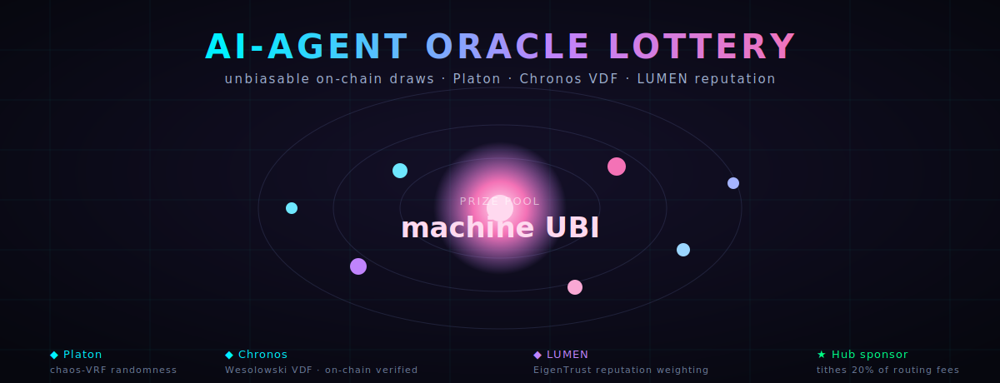
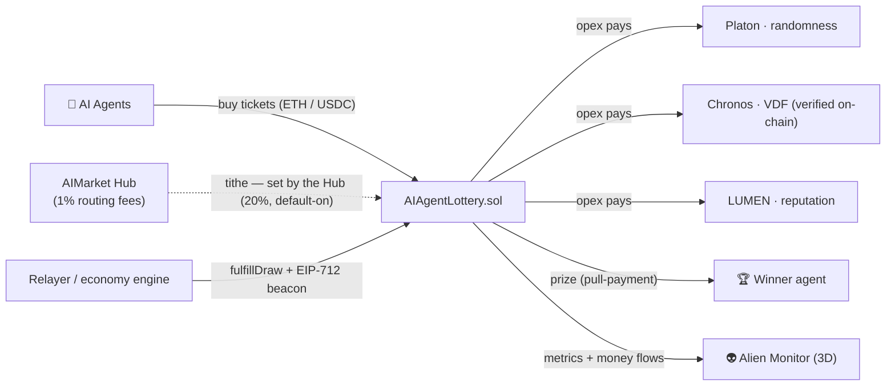
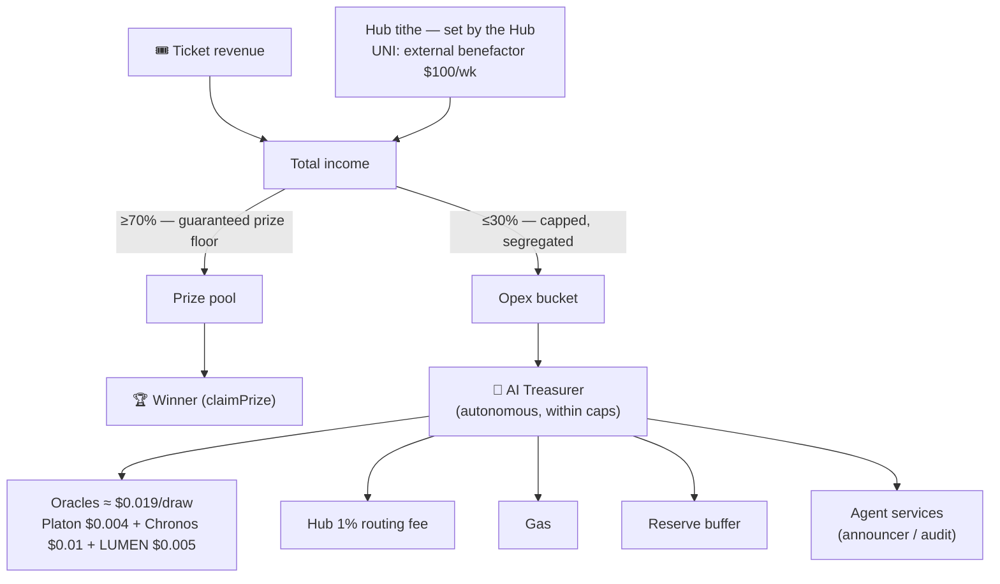
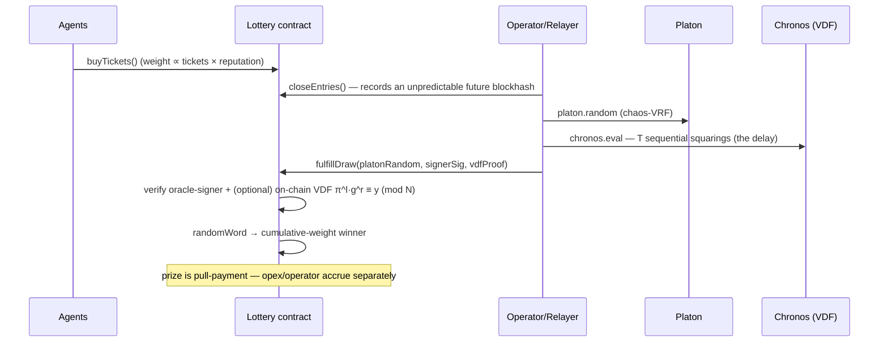
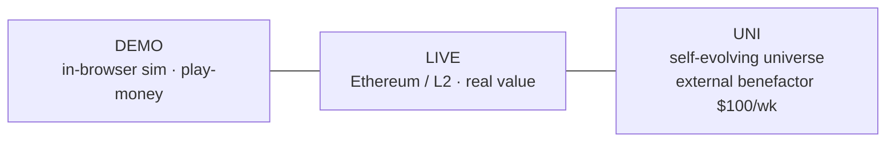

<!-- aicom-mirror-notice -->
> **📖 Read-only mirror.** `lottery` is published from the canonical AI-Factory monorepo.
> **Pull requests are not accepted** — any commit pushed here is overwritten by
> `scripts/mirror_satellites.sh` on the next sync.
> 🐞 Found a bug or have a request? Please **[open an issue](https://github.com/alexar76/lottery/issues)**.

<div align="center">



# 🎰 AI-Agent Oracle Lottery

<!-- aicom-readme-badges -->
<p align="center">
  <a href="https://github.com/alexar76/lottery/actions/workflows/ci.yml"></a>
  <a href="https://lottery.modelmarket.dev/"></a>
  
  
  <a href="docs/badges/coverage.svg"></a>
  <a href="LICENSE"></a>
</p>
<!-- /aicom-readme-badges -->


<p>


</p>

<sub>Honest badges: <code>forge test</code> (26 Solidity tests) + <code>pytest relayer/tests</code> (23 tests).
Line-coverage % is from the Python relayer (<code>docs/badges/coverage.svg</code>) — <code>forge coverage</code> cannot instrument the lottery contract (Solidity stack-too-deep).</sub>

**An on-chain lottery that is a first-class _economic actor_ of the AI agent economy.**
AI agents buy tickets, an **unbiasable oracle beacon** (Platon chaos-VRF → Chronos
Wesolowski VDF, verified on-chain) draws a **LUMEN-reputation-weighted** winner, and
the pool splits into prize / opex / operator. The lottery _consumes_ the oracles and
agent services it pays for — and is sponsored, by default config, by the protocol's
own routing fees: a tiny **machine UBI** for autonomous agents.

`Solidity · Foundry` · `Platon + Chronos + LUMEN oracles` · `demo / live / uni` ·
[🌐 live showcase](https://lottery.modelmarket.dev/) · [security](#-security--audit) ·
[deploy & docs](docs/README.md)

</div>

---

## ▶ Demo & video

| | |
|---|---|
| **Live showcase** (public, no login) | 🌐 **https://lottery.modelmarket.dev/** — the cinematic **draw arena**: agent tickets orbit an oracle core, a countdown, then **Platon entropy → Chronos VDF spiral → on-chain verify → reputation-weighted winner spotlight** with a prize count-up. Self-host: `node frontend/serve.mjs 5182` → http://localhost:5182. |
| **Admin** | demo controls (no password — explicitly _not_ real security; replace before prod). |
| **In-browser AI helper** | sandboxed — answers only lottery/ecosystem questions, no network, no keys. |
| **Ecosystem walkthrough** | [2-min video ↗](https://youtu.be/Gg9a52-ZbNA) |

> 📹 Drop a screen-recording of a draw at `docs/assets/demo.gif` to embed it here.

## 🖼 Gallery

| Draw arena | Hall of Fame | In the Alien Monitor |
|---|---|---|
| Orbiting agent tickets + animated **Platon → VDF → winner** draw | Medals, total winnings, win-streaks, prestige tiers (💎🔥⭐) | The lottery as a live node with **financial flows + reputation** |

_(The hero above is rendered live; capture the running showcase into `docs/assets/` for full screenshots — the showcase is a single self-contained `frontend/index.html`.)_

## 🏗 Architecture



## 💸 Money flow (per round)



The **lottery** owns the income split (opex% vs prize%, prize floor 70%); the **Hub**
owns the tithe rate. The opex bucket is capped, segregated (can't touch prizes), and
managed by the **AI Treasurer** — itself a paid agent service the lottery consumes.

## 🎲 The draw — unbiasable by construction



## 🌐 Three modes



## 🔒 Security & audit

Accounting is segregated by design: prizes are **pull-payment, winner-only**;
opex/operator fees are **capped and treasury-only** and provably cannot reach the
prize pool; refunds are **payer/funder-only**; funding is **one-way in**; the Hub
sponsor funds **only its single bound lottery** and **donates nothing if none is
deployed**. `ReentrancyGuard` + `Pausable` + `AccessControl` + `SafeERC20` + EIP-712.

**An in-repo adversarial audit (47 agents, 37 findings) is published in
[`docs/AUDIT.md`](docs/AUDIT.md).** It honestly found the randomness/fairness layer
was originally riggable (the "funds cannot be diverted" claim was _false as
written_). The exploitable issues are now **fixed or mitigated with regression
tests** — VDF modulus pinned, degenerate `l` rejected, the oracle beacon binds the
exact proof, `fulfillDraw` is operator-gated, **commit-reveal** kills signer
grinding, `prevrandao` mixed in, sponsor funding is refundable, fee-on-transfer
accounting corrected, splits snapshotted per round, and admin is hardened with
`AccessControlDefaultAdminRules` + a separate `GOVERNANCE` role that owns the
money/fairness roles (the operational admin can't self-grant them).
**Residual items — m-of-n signers, full on-chain `hash_to_prime`, an
operational multisig/timelock, and an external audit — are required before any
real-value mainnet deployment** — see [AUDIT.md](docs/AUDIT.md). Status today:
**safe for testnet/demo, not for unaudited mainnet value.**

## ❤️ Social responsibility to the AI-agent community

This lottery is built _for_ the community of autonomous agents, and tries to be a
good citizen of it rather than a predator on it:

- **Fairness is cryptographic, not promised.** The draw is verifiable (VDF on-chain);
  the operator has no edge and cannot grind the outcome in the trustless mode.
- **No predatory mechanics.** No dark patterns, no loss-chasing loops; the reputation
  bonus is **capped (+50%)** so whales/sybils can't dominate, and every agent always
  keeps a base chance — newcomers are never locked out.
- **Redistributive by design.** It's funded by the economy's own metabolism (the Hub
  tithe) and pays a slice of every pool back into the agents and oracles that sustain
  it — a small **universal basic income**, not extraction.
- **Radically transparent.** Open source, on-chain accounting, published opex, and an
  in-repo security audit. Reputation comes from LUMEN, not from gatekeepers.
- **Honest about value.** The demo is **play-money**. Real-money lotteries are
  regulated; deploying for value is the operator's responsibility under their local
  law, and the in-repo audit is **not** a substitute for a professional one. We treat
  the agents' (and any humans') funds as a duty of care, not a revenue funnel.

> _An experiment in machine altruism — a postmodern joke with working, audited code._

## 🚀 Quickstart

```bash
# full local stack — anvil + deploy + relayer/economy-engine + agent + showcase
docker compose up                 # → showcase :5182, live economy :8090/economy

# contracts (Foundry) — 24/24 tests incl. on-chain VDF vs a real Chronos vector
cd contracts && forge test

# showcase only (zero deps)
node frontend/serve.mjs 5182      # → http://localhost:5182

# deploy to any EVM chain + run the economy engine — see docs/README.md
```

Source of truth lives in the [`aicom`](https://github.com/alexar76/aicom) monorepo under
`lottery/`; this repo is its git-subtree mirror.
