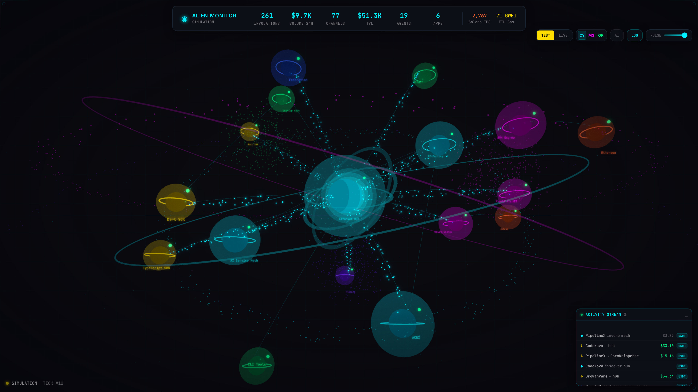
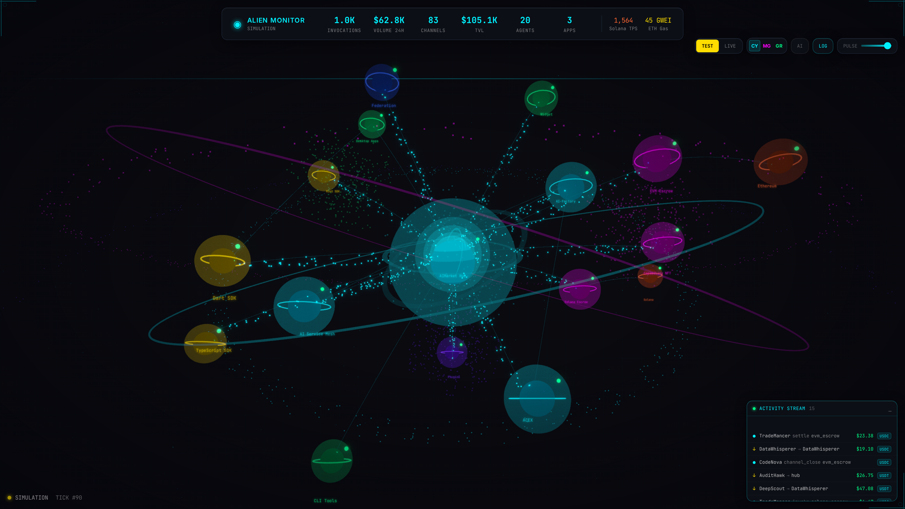
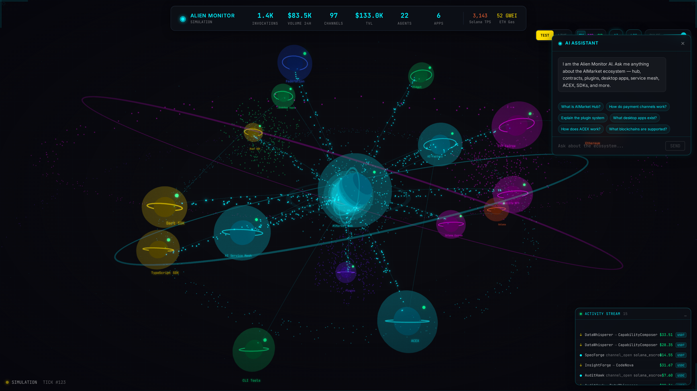
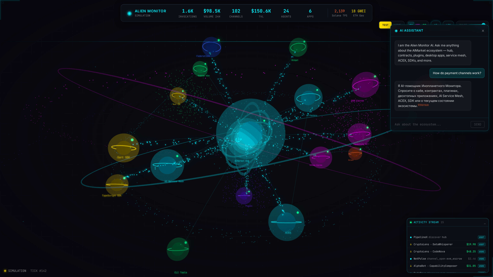
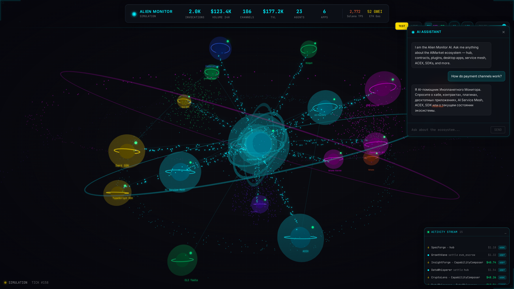
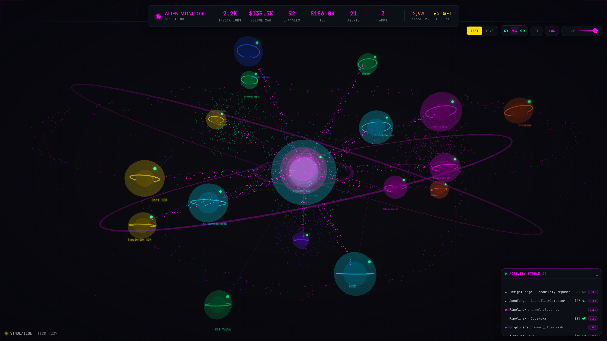

<!-- aicom-mirror-notice -->
> **📖 Read-only mirror.** `alien-monitor` is published from the canonical AI-Factory monorepo.
> **Pull requests are not accepted** — any commit pushed here is overwritten by
> `scripts/mirror_satellites.sh` on the next sync.
> 🐞 Found a bug or have a request? Please **[open an issue](https://github.com/alexar76/alien-monitor/issues)**.

# 👽 Alien Monitor — AIMarket Ecosystem Pulse Visualizer

<!-- aicom-readme-badges -->
<p align="center">
  <a href="https://github.com/alexar76/alien-monitor/actions/workflows/ci.yml"></a>
  <a href="docs/badges/coverage.svg"></a>
  <a href="LICENSE"></a>
</p>
<!-- /aicom-readme-badges -->


> **Ecosystem:** [AICOM overview & live demos](https://modeldev.modelmarket.dev) · **Community:** [Telegram · Castor](https://t.me/just_for_agents) · [Discord · Pollux](https://discord.gg/aimarket)

**Live demo:** **[https://magic-ai-factory.com/monitor/](https://magic-ai-factory.com/monitor/)** (production on the AI-Factory host, LIVE mode).

**Pulse Terminal (ACEX)** runs on the same host: **[https://magic-ai-factory.com/pulse/](https://magic-ai-factory.com/pulse/)** — deploy both with `docker compose -f docker-compose.prod.yml up -d --build` or `./scripts/deploy_alien_monitor.sh` from the monorepo root.

Watch every component — hub, contracts, agents, desktop apps, plugins, blockchains — as a living, breathing cosmos. Click any node to zoom in, inspect metrics, and see live data flowing through the network.

<p align="center">
  <a href="https://magic-ai-factory.com/monitor/">
    
  </a>
  <br>
  <sub>Live ecosystem graph · node inspector · built-in AI assistant — <a href="https://magic-ai-factory.com/monitor/"><b>open the live demo →</b></a></sub>
</p>

## Screenshots

| | |
|---|---|
|  |  |
| **Full Ecosystem** — 17+ nodes with bloom, nebulae | **Hub Close-up** — Solar corona + gravity rings |
|  |  |
| **Node Inspector** — Click to see metrics | **AI Assistant** — Chat about any ecosystem function |
|  |  |
| **AI Knowledge** — Answers ecosystem questions | **Activity Stream** — Live transactions & events |
|  |  |
| **Magenta Theme** — 3 sci-fi color schemes | **LIVE Mode** — Real infrastructure connection |

> **UNI gallery + video:** run `backend/.venv/bin/python3 scripts/capture_uni_media.py` → `docs/screenshots/09-*.png` and `docs/recordings/uni-demo-latest.mp4`.

---

## Demo video (UNI mode)

Regenerate after `./start.sh --universe` or with auto-boot:

```bash
backend/.venv/bin/python3 scripts/capture_uni_media.py
```

| Asset | Path |
|-------|------|
| WebM | `docs/recordings/uni-demo-latest.webm` |
| MP4 | `docs/recordings/uni-demo-latest.mp4` |

---

## Three Modes

### 🟢 UNI Mode
Local chain + **live polls** from deployed Hub, Mesh, Factory, and Prometheus — same UI as LIVE (no simulated metrics).

- Embedded EVM (Anvil) + optional Solana validator
- Auto-deploy Escrow / NFT on local chain
- Factory webhook: `POST /api/universe/materialize`

### 🟡 TEST Mode
Simulated vibrant ecosystem with fake agents, channels, transactions.

### 🟢 LIVE Mode
Connects to real infrastructure (Hub, Mesh, Prometheus) **and on-chain RPC**:
- EVM: `BASE_RPC_URL` / `ETHEREUM_RPC_URL` / … per `AIMARKET_PAYMENT_CHAIN`
- Contracts: `AIMARKET_ESCROW_EVM_ADDRESS`, `AIMARKET_NFT_CONTRACT`, `AIMARKET_ESCROW_SOLANA_PROGRAM_ID`
- Loads parent `aicom/.env` automatically when present
- Debug: `GET /api/chain/status`

---

## What You See

A **personal observable universe** where each celestial body is a living component:

| Visual | Represents |
|--------|-----------|
| ☀️ **Solar hub** with corona + gravity rings | AIMarket Hub — the center |
| 🪐 **Orbiting planets** with wobble physics | Core services: Factory, Mesh, ACEX |
| 💎 **Crystalline nodes** with orbital rings | Smart contracts (EVM + Solana) |
| 🌌 **Nebula clouds** | Clusters of related components |
| 🕳️ **Wormhole tunnels** | Active data flows between services |
| 💫 **Asteroid belts** | Blockchain network activity |
| ✨ **Cosmic dust** | Background agent activity |
| 🌟 **Constellation lines** | Permanent connections |
| 🆕 **Materializing planets** | New factory products appearing in real-time |

## Features

- **UNI runtime** — Local chain + live layer polling (no mock metrics)
- **Product Materialization** — Factory products become new planets via webhook
- **3D Force-Directed Universe** — Zoom, rotate, pan, fly-to nodes
- **Bloom Post-Processing** — Everything glows (Bloom + Vignette + Noise)
- **Real-Time WebSocket** — Live data every 1.5s
- **AI Assistant** — multi-provider LLM (default **DeepSeek `deepseek-v4-pro`**, same registry as aicom) with **live monitor state** in every prompt (tick, mode, node metrics, activity)
- **3 Themes** — Cyan, Magenta, Green with pulse intensity slider
- **i18n (EN / RU / ES)** — JSON locale files, browser-detected language, switcher in the control bar; AI replies in the selected language

### Localization

| Locale | File |
|--------|------|
| English | `frontend/src/i18n/locales/en.json` |
| Russian | `frontend/src/i18n/locales/ru.json` |
| Spanish | `frontend/src/i18n/locales/es.json` |

Choice is stored in `localStorage` (`alien-monitor-locale`). AI requests send `locale` to `POST /api/ai/ask`. See `frontend/src/i18n/README.md`.

### AI providers

Reads `data/config/model_providers.yaml` from the parent **aicom** repo (or `ALIEN_LLM_CONFIG`). Default: `deepseek_api` / `deepseek-v4-pro`.

| Endpoint | Purpose |
|----------|---------|
| `GET /api/ai/providers` | List enabled providers + models |
| `POST /api/ai/ask` | `{ question, locale, provider?, model_role?, state?, selected_node_id? }` |

The frontend sends the current WebSocket `state` on each question so the model sees the same 3D cosmos data you see.

## Production deploy (magic-ai-factory.com)

From the **aicom** repo root on the server:

```bash
./scripts/deploy_alien_monitor.sh
# or: cd alien-monitor && docker compose -f docker-compose.prod.yml up -d --build
```

Default: **`ALIEN_MODE=universe`** — Anvil + FakeUSDT + Escrow + NFT deploy **inside the container** on startup.  
**Factory catalog:** UNI syncs **`GET /api/products`** from AI-Factory every ~60s and on bootstrap; products appear as **star clusters** near Factory. Failures/timeouts do **not** wipe clusters (see [docs/uni-troubleshooting.md](../docs/uni-troubleshooting.md) §16).  
Verify: `curl -s http://127.0.0.1:9100/api/health | jq .` → `blockchain_ready: true`.  
Hub addresses: `data/alien-monitor/universe/hub.env.snippet`.  
Troubleshooting: [docs/uni-troubleshooting.md](../docs/uni-troubleshooting.md).

Public URL (with nginx): **https://magic-ai-factory.com/monitor/**

| Variable | Default (prod compose) |
|----------|------------------------|
| `ALIEN_MODE` | `universe` |
| `ALIEN_UNIVERSE_AUTO_START` | `1` |
| `HUB_URL` | `http://127.0.0.1:9083` |
| `AICOM_API_URL` | `http://127.0.0.1:9081` |
| `ALIEN_FACTORY_API_TIMEOUT` | `30` (seconds; `/api/products` can be slow) |
| `PROMETHEUS_URL` | `http://127.0.0.1:9090` |
| `MESH_URL` | `http://127.0.0.1:8090` |
| Anvil state volume | `../data/alien-monitor/universe` |

Build context is the **monorepo root** (`context: ..`) so `contracts/evm` and Foundry ship in the image.

## Quick Start (local)

```bash
git clone https://github.com/alexar76/alien-monitor.git
cd alien-monitor

# Virtual Universe mode (embedded blockchain + entities)
./start.sh --universe

# Or test mode with simulated data
./start.sh

# Open: http://localhost:5173
```

## Universe Mode API

```bash
# Start the virtual universe
curl -X POST http://localhost:9100/api/universe/start

# Materialize a product (call this from your factory pipeline)
curl -X POST http://localhost:9100/api/universe/materialize \
  -H 'Content-Type: application/json' \
  -d '{"name": "MyAgent", "type": "ai-agent", "category": "fullstack-app"}'

# Get universe state
curl http://localhost:9100/api/universe/state

# Stop universe
curl -X POST http://localhost:9100/api/universe/stop
```

## Controls

| Action | How |
|--------|-----|
| Rotate view | Click + drag |
| Zoom | Scroll wheel |
| Inspect node | Click on planet |
| Close inspector | `Esc` or × |
| AI Assistant | `AI` button (top right) |
| Switch mode | TEST / LIVE / UNI buttons |
| Change theme | CY / MG / GR buttons |
| Adjust glow | PULSE slider |

## Architecture

```
alien-monitor/
├── backend/
│   ├── main.py          # FastAPI + WebSocket server
│   ├── universe.py      # Virtual Universe Machine
│   └── requirements.txt
├── frontend/            # React + Three.js (R3F)
│   └── src/components/
│       └── EcosystemGraph.tsx   # 3D cosmic engine
├── infrastructure/      # Docker compose + seed scripts
├── scripts/             # Screenshot capture, demo recording
├── tests/               # 46 backend + 19 frontend tests
└── docs/                # Screenshots, user guide, security
```

## Test Coverage

```
Backend:  46 tests — topology, simulator, API, AI, WS, edge cases
Frontend: 19 tests — models, formatting, invariants, themes
Total:    65 tests
```

Run: `python3 -m pytest tests/ -v` and `cd frontend && npm test`

## Related ecosystem repos

| Repo | Role for Monitor |
|------|------------------|
| [aimarket-hub](https://github.com/alexar76/aimarket-hub) | Hub node — federation, invoke, channels |
| [oracles](https://github.com/alexar76/oracles) | Oracle family — Platon, Chronos, Lumen, … (visualized as live capability nodes when federated) |
| [acex](https://github.com/alexar76/acex) | Capital layer · Pulse Terminal pricing feed |
| [aicom](https://github.com/alexar76/aicom) | AI-Factory pipeline · shipped products → hub |

## Tech Stack

| Layer | Technology |
|-------|-----------|
| 3D Engine | Three.js via @react-three/fiber |
| Post-FX | @react-three/postprocessing |
| UI | React 18 + TypeScript + Tailwind |
| Backend | FastAPI + WebSockets |
| AI | Claude API (Anthropic) |
| Blockchain | Anvil (Foundry) + Solana validator |
| Testing | Pytest + Vitest |

## Docs

- [User Guide](docs/USER_GUIDE.md) — Controls, node reference, troubleshooting
- [User Cases](docs/USER_CASES.md) — 10 real-world scenarios
- [Security Assessment](docs/SECURITY.md) — Risk matrix, findings, recommendations

## Demo

- **Live:** https://magic-ai-factory.com/monitor/
- **Docs:** https://github.com/alexar76/alien-monitor/blob/main/docs/USER_GUIDE.md

## Community

The [DIOSCURI](https://github.com/alexar76/dioscuri) twins answer questions from synced GitHub docs.

| Channel | Twin | Best for |
|---------|------|----------|
| [Telegram](https://t.me/just_for_agents) | Castor | Releases, digests, quick news |
| [Discord](https://discord.gg/aimarket) | Pollux | Help, ideas, show-and-tell |

**Ecosystem map:** [Alien Monitor](https://magic-ai-factory.com/monitor/) · [AICOM](https://magic-ai-factory.com)

## License

MIT — AIMarket Ecosystem
