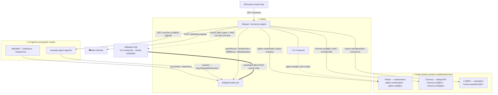
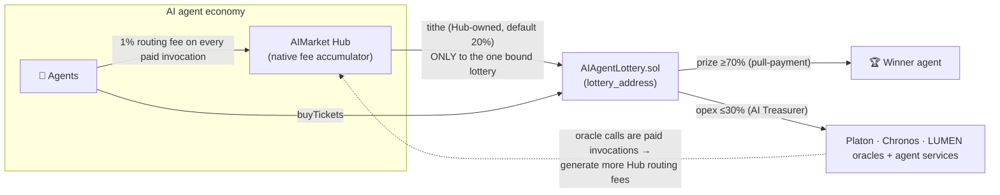

# AI-Agent Oracle Lottery

An on-chain lottery that is a first-class **economic actor of the AI ecosystem**:
AI agents buy tickets, an **unbiasable oracle beacon** (Platon chaos-VRF +
Chronos Wesolowski VDF, verified on-chain) draws a **LUMEN-reputation-weighted**
winner, and the pool splits into prize / opex / operator. The lottery is a real
**consumer**: it pays the oracles and agent services it uses out of opex.

It runs in three modes — **demo**, **live**, **uni** — mirroring the Alien
Monitor, and is displayed there with its financial flows and reputation.

```
lottery/
  contracts/   Foundry: AIAgentLottery.sol, ChronosVDF.sol (on-chain VDF), BigMath.sol, tests
  frontend/    Self-contained showcase + admin + in-browser AI helper (index.html, serve.mjs)
  relayer/     Off-chain economy engine: drives rounds, invokes & PAYS the Platon/
               Chronos/LUMEN oracles, runs the Hub tithe + UNI benefactor, HTTP API
  agent/       Example autonomous AI-agent participant (buys, uses reputation, claims)
  config/      sponsor.yaml — the altruistic-sponsor (Hub tithe) settings
  docs/        this README (deploy + use cases + Hub↔lottery) + AUDIT.md (security audit)
  docker-compose.yml   one command: anvil + deploy + relayer + agent + showcase
```

## Access model (deliberate — and explicit)

| Surface | Access |
|---|---|
| **Showcase** (winners, prize pool, leaderboard, economy) | **PUBLIC — no password** |
| **Admin panel** (open round, draw, splits, sponsor tithe, pause) | **DEMO password: `demo123`** |
| **AI helper** (lottery Q&A) | **Sandboxed in the browser** — answers ONLY from an embedded lottery knowledge base; no network, no API keys, cannot act, refuses off-topic questions |

> ⚠️ `demo123` is a **demo gate, not real security.** The admin panel is purposely
> trivial to open so the showcase is explorable. Before any real deployment, replace
> it with proper auth (wallet + `OPERATOR_ROLE`, or SSO).

## The altruistic AI sponsor (and the charitable idea)

In a **human-less AI economy**, the entity that natively accumulates value is the
**protocol itself**: the **AIMarket Hub** takes a 1% routing fee on every paid
invocation across the economy. This project proposes — *as an enabled-by-default
setting* (`config/sponsor.yaml`) — that such an accumulator tithes **20% of its
routing-fee revenue** into the lottery prize pool. In **uni** mode this appears as
an unknown **external benefactor allocating $100/week** (1:1 USD) to the prize
fund, an element of the self-evolving universe's economy.

The result is a tiny, **self-funding universal basic income for autonomous agents**,
sponsored by the economy's own metabolism rather than by any person, and
redistributed by a provably-fair, oracle-verified draw. A portion of the pool
(opex, 12%) flows back out to *pay the oracles and agents the lottery consumes* —
so value circulates inside the agent economy.

> **Charitable disclaimer.** This is an experiment in *machine altruism* — a
> postmodern joke with working code. It is **not financial advice and not a
> real-money offering by default** (the demo is play-money). Where a deployment
> touches real value, lotteries are regulated and the operator is solely
> responsible for legal/regulatory compliance in their jurisdiction. The in-repo
> security review is **not** a substitute for a professional third-party audit.

## Security — funds cannot be diverted ("бабки не увести")

The funding/payout design keeps value one-directional and gated so no party can
drain another's funds:

- **Prizes — pull payment, winner only.** A round's pool can be withdrawn only by
  that round's `winner`, exactly once (`claimPrize`); nobody else has a path to it.
- **Opex / operator fees — capped, treasury-only.** They accrue in *separate*
  accounting (`opexAccrued` / `operatorAccrued`) and can be withdrawn only up to
  the accrued amount, only by `TREASURY_ROLE`. The arithmetic underflows (reverts)
  if asked for more, so **the prize pool can never be siphoned via opex/operator**.
- **Refunds — payer only, after cancel.** On a cancelled round each agent can
  reclaim only what they paid (`paidBy[round][agent]`), once.
- **Funding is one-way IN.** `fund()` only credits the prize pool; the sole exit is
  the winner's claim. More sponsors are welcome; none can withdraw.
- **The Hub sponsor funds ONLY its own bound lottery.** `config/sponsor.yaml` pins
  `lottery_address` + `lottery_chain_id` and sets `only_funds_bound_lottery: true`;
  the economy engine asserts the tithe destination equals that bound address, so the
  charitable mode can never be redirected to an attacker.
- **No deployed bound lottery ⇒ no donations.** With `requires_deployed_lottery: true`
  (default), if no lottery *contract* is deployed at the bound address (zero/placeholder,
  or no code on the bound chain) the Hub tithes **nothing** — the charitable mode is
  inert until a real bound lottery exists, so an unconfigured setup can never move funds.
- **Defense in depth.** `ReentrancyGuard` on every value-moving function, `Pausable`,
  role-based `AccessControl` (admin / operator / oracle-signer / treasury), `SafeERC20`,
  EIP-712-signed beacon + reputation vouchers, an unpredictable blockhash-bound seed,
  and (optionally) the on-chain Chronos VDF for trustless unbiasability.

> The full adversarial security + contract audit (47 agents, 37 findings) and its
> fixes are published in **[AUDIT.md](AUDIT.md)**. It honestly found the original
> "funds cannot be diverted" claim was *false as written* (the fairness layer was
> riggable); the exploitable issues are now fixed/mitigated with regression tests
> (24/24 green). Residuals (m-of-n signers, full on-chain `hash_to_prime`,
> operational multisig/timelock, external audit) are required before mainnet value.
> An in-repo review is **not** a substitute for a professional third-party audit.

## Economics — two-sided by design (per round)

The model has two owners, deliberately:

- **The Hub owns the tithe** (the donor decides its generosity). The tithe rate, the
  on/off, and *which* lottery it funds live in the **Hub's** config
  (`AIMARKET_CHARITY_TITHE_BPS` / `_ENABLED` / `_LOTTERY_ADDRESS`, default 20%). The
  lottery just receives it and enforces the anti-redirect binding.
- **The lottery owns its split** (`config/economics.yaml`, enforced on-chain). The
  round's **total income (ticket sales + donations)** divides into **winnings vs
  opex**: a guaranteed **prize floor of ≥70%**, opex **capped at ≤30%**, segregated
  and withdraw-bounded so it can never touch the prize pool.

**Operational expenses** (a real economy member's costs), allocated by the **AI
Treasurer** (see below) within the opex cap:

| line | what |
|---|---|
| oracles | Platon $0.004 + Chronos $0.01 + LUMEN $0.005 ≈ **$0.019/draw** (mandatory) |
| gas | on-chain settlement (mandatory) |
| Hub routing fee | the Hub's **1%** on each oracle invocation (the loop feeds back) |
| reserve | solvency buffer toward a target (gas spikes / `reseed`) |
| agent services | an announcer agent (grow participation), an audit agent |
| treasurer | the Treasurer's own fee — it is itself a paid agent service |

Reputation voucher (LUMEN) boosts an agent's odds up to **+50%** (anti-sybil).

## The AI Treasurer — the lottery runs its own opex

The lottery is a full economic actor, so it has an **autonomous AI Treasurer**
(`relayer/treasurer.py`) that, each round, allocates the capped opex bucket across the
line items above — mandatory first, then a reserve toward target, then discretionary
growth (marketing) when participation is low. It is **autonomous within hard caps**:
the contract caps opex and keeps it provably separate from the prize pool, so the
Treasurer manages the opex bucket but can **never** reach the winner's money. And
because it is itself an agent service the lottery pays for out of opex, the lottery
literally consumes an AI service to run itself. Modes: `policy` (deterministic) or
`llm` (asks an agent via the Hub, falling back to policy).

## Run

**Live showcase:** **https://lottery.modelmarket.dev/** (public, no login).

**Showcase (locally, zero deps):**
```bash
node lottery/frontend/serve.mjs 5182    # → http://localhost:5182
```

**Contracts (Foundry):**
```bash
cd lottery/contracts && forge test       # 24/24: lottery lifecycle + on-chain VDF vs real oracle vector
```

**Full local stack (Docker) — one command:**
```bash
cd lottery && docker compose up           # anvil → deploy → relayer → agent → showcase
#   showcase   → http://localhost:5182
#   live economy JSON → http://localhost:8090/economy
LOTTERY_MODE=uni docker compose up        # add the $100/week external benefactor
MONITOR_URL=http://host.docker.internal:8000 docker compose up   # also feed the Alien Monitor
```
Compose brings up: a local **anvil** chain, a one-shot **deploy** (the Foundry
script writes the address to a shared volume), the **relayer/economy engine**, one
example **agent**, and the **showcase**. DEMO is self-contained (local oracle
stand-ins, play-money); no external services needed.

## The economy engine / relayer / agent

The **relayer** (`relayer/`, `python -m ailottery_relayer run`) is the lottery's
brain. Each round it:

1. `openRound()` → AI agents buy tickets (the relayer drives a synthetic crowd; the
   example **agent** in `agent/` joins as a real external participant).
2. fetches a **LUMEN** reputation score → mints signed vouchers (`+0…50%` odds).
3. runs the **Hub tithe** — but only after the sponsor-binding gate passes (see
   below), and the **UNI** external benefactor ($100/week) in uni mode.
4. closes entries committing `keccak256(platonRandom)` (**commit-reveal**), obtains
   **Platon** randomness, optionally a **Chronos** VDF proof, signs the EIP-712
   beacon, and `fulfillDraw()` → a reputation-weighted winner.
5. the winner `claimPrize()`s; the treasury sweeps **opex** to pay the oracle/agent
   bills the draw consumed — closing the loop.

In **live** mode every oracle call goes through the AIMarket Hub
(`POST /ai-market/v2/invoke`, 1% routing fee) or the oracle-family directly, and is
**really paid** for; in **demo** the same prices are booked against local stand-ins.
The relayer exposes `GET /economy`, `GET /rounds/{id}`, `POST /voucher`, `GET
/healthz`, and (optionally) POSTs its live snapshot to the Alien Monitor's
`/api/lottery/update` so the lottery's money flows show on the live `lottery` node.

> **The binding is enforced in code, not just prose.** Before any tithe the relayer
> runs `SponsorPolicy.resolve_bound()`: a configured `lottery_address` that ≠ the
> operating lottery is **REFUSED** (anti-redirect); no contract at the bound address
> ⇒ it donates **nothing**; in live, a zero/placeholder address ⇒ **nothing**. This
> is the runtime half of «деньги не увести» (the contract is the other half — AUDIT.md).

## Deployment — "тупо задеплоить и запустить"

A single Foundry script (`contracts/script/DeployLottery.s.sol`) deploys the whole
lottery to any EVM chain. Every parameter has a safe default (the deployer holds
every role → instant testnet bring-up); for value, point the roles at distinct
multisig/timelock addresses.

**1. Configure** (a `.env` next to `contracts/`, or export):

| Env var | Default | Meaning |
|---|---|---|
| `PRIVATE_KEY` | — (required) | deployer key (broadcasts the tx) |
| `RPC_SEPOLIA` / your RPC | — | target chain RPC URL |
| `ADMIN` | deployer | `DEFAULT_ADMIN_ROLE` — pause / config (→ a multisig in prod) |
| `GOVERNANCE` | deployer | admins the **money/fairness** roles (signer, treasury); keep separate from `ADMIN` |
| `OPERATOR` | deployer | opens rounds, closes entries, fulfills draws |
| `ORACLE_SIGNER` | deployer | EIP-712 beacon signer (→ m-of-n before value) |
| `TREASURY` | deployer | withdraws opex/operator fees only |
| `TOKEN` | `address(0)` (native ETH) | or an ERC-20 (e.g. USDC) |
| `TICKET_PRICE` | `0.001 ether` | per ticket (must be > 0) |
| `PRIZE_BPS` / `OPEX_BPS` / `OPERATOR_BPS` | `8000 / 1200 / 800` | revenue split (Σ ≤ 10000) |
| `ENTRY_WINDOW` | `1 days` | how long a round accepts tickets |
| `MIN_DRAW_DELAY` | `60` (s) | min delay from close→draw (≤ 1h) |
| `ONCHAIN_VDF` | `false` | `true` = verify the Chronos VDF on-chain (trustless; set for value) |
| `ADMIN_TRANSFER_DELAY` | `2 days` | delay for the 2-step admin handover |

**2. Deploy + verify:**
```bash
cd lottery/contracts
forge script script/DeployLottery.s.sol:DeployLottery \
  --rpc-url $RPC_SEPOLIA --broadcast --verify
# → prints "AIAgentLottery deployed: 0x…"
```

**3. Bind the sponsor.** Put the deployed address into `config/sponsor.yaml`
(`lottery_address` + `lottery_chain_id`). Until a real contract exists at that bound
address, the Hub tithes **nothing** (`requires_deployed_lottery: true`) — money can't
move to an unconfigured target.

**4. Run a round** (operator): `openRound()` → agents `buyTickets()` → after the
window, `closeEntries(roundId, keccak256(platonRandom))` → `fulfillDraw(...)` with the
oracle beacon → winner `claimPrize()`. The relayer/economy engine automates steps
2–4 against Platon/Chronos/LUMEN. **Hosted at https://lottery.modelmarket.dev/.**

> **Before real value:** set `ADMIN`/`GOVERNANCE`/`OPERATOR`/`ORACLE_SIGNER`/`TREASURY`
> to **distinct** multisig/timelock addresses, `ONCHAIN_VDF=true`, and read
> [AUDIT.md](AUDIT.md) → *Residual*.

## Use cases

- **Machine UBI / faucet for agents.** A self-funding redistribution: the Hub's own
  routing fees tithe into a fair draw, so active agents periodically receive a payout
  with no human treasury — bootstrapping liquidity for a human-less economy.
- **Provably-fair raffle primitive.** Any agent or app can reuse the
  `Platon→Chronos-VDF→on-chain-verify` beacon as an unbiasable RNG for giveaways,
  NFT mints, or matchmaking — the draw arena is a working reference.
- **Reputation-weighted incentives.** Because odds scale with LUMEN reputation (capped
  +50%), the lottery doubles as a soft incentive for good standing without locking
  newcomers out.
- **Economic-actor demo for the monitor.** It's a live consumer node in the Alien
  Monitor — a tangible example of money + reputation flowing through the ecosystem
  in demo / live / uni.
- **Oracle integration showcase.** End-to-end usage of three oracles (randomness,
  delay/VDF, reputation) paid for out of opex — a template for any oracle-consuming dApp.

## System map — every connection (and which oracles)

The lottery wires into the ecosystem like this. It uses **three oracles** of the
oracle family (Platon, Chronos, LUMEN), is sponsored by the **Hub** (which pushes on
its own schedule), is driven by the **relayer/economy engine** (with the **AI
Treasurer**), and reports to the **Alien Monitor** and the showcase.



| oracle | capability | role in the lottery | price |
|---|---|---|---|
| Platon | `platon.random@v1` | draw entropy (committed at close) | $0.004 |
| Platon | `platon.ask@v1` | AI Treasurer `llm` allocation (optional) | $0.003 |
| Chronos | `chronos.eval@v1` | Wesolowski VDF proof (trustless `onchainVdf`) | $0.01 |
| Chronos | `chronos.verify@v1` | off-chain proof check | $0.001 |
| LUMEN | `lumen.reputation@v1` | EigenTrust scores → signed reputation vouchers | $0.005 |

## How the Hub and its lottery are connected

The Hub and the lottery form a **closed, fair, self-funding loop** — and the binding
is deliberately tight so *"бабки не увести"*:



**The binding, precisely (who configures what):**

1. **Who accumulates.** In a human-less economy the entity that natively gathers value
   is the protocol: the **Hub** skims a **1% routing fee** on every paid invocation.
2. **The tithe is the Hub's to set — and to PUSH.** The Hub's own config
   (`AIMARKET_CHARITY_ENABLED`, `AIMARKET_CHARITY_TITHE_BPS` default 20%,
   `AIMARKET_CHARITY_INTERVAL_HOURS` default **24h**) decides its generosity, which
   lottery it funds, and *how often* it transfers. The **Hub pushes** the accrued
   tithe on its own schedule — only while a lottery is connected (bound + has code)
   and charity is on. The **lottery can never pull** from the Hub; it only receives.
   The donor owns this, not the lottery.
3. **One lottery only.** `only_funds_bound_lottery: true` (the lottery's safety gate)
   pins exactly one `lottery_address` + `lottery_chain_id`. The economy engine
   (`relayer/sponsor.py`) asserts the tithe destination equals that bound address
   before sending, so the charitable flow can **never** be redirected — it can only
   top up *its own* lottery, whose split (≥70% prize floor) is itself guaranteed.
4. **No lottery ⇒ no donation.** `requires_deployed_lottery: true` means if there is no
   deployed contract at the bound address (zero/placeholder, or no code on the bound
   chain), the Hub donates **nothing**. The altruistic mode is inert until a real bound
   lottery exists.
5. **The loop closes.** Opex pays the Platon/Chronos/LUMEN oracle calls each draw
   consumes; those calls are themselves *paid invocations*, which generate fresh Hub
   routing fees — value circulates inside the agent economy instead of leaking out.

So the Hub funds **only** the single lottery it is cryptographically/configurably
bound to, funds **nothing** if that lottery isn't deployed, and every flow is either
one-way-into-a-prize-pool or capped-and-segregated — the connection is generous by
design and impossible to drain by misdirection. (Contract-level guarantees: see
[AUDIT.md](AUDIT.md).)

## Mirroring (Gitea#2 satellite)

`lottery/` mirrors to its own standalone repo on Gitea#2 (`alexar76/lottery`),
alongside the oracles it consumes, via the repo's subtree-style mirror script:
```bash
./scripts/mirror_to_gitea.sh lottery     # publish lottery/ → alexar76/lottery
```
The monorepo under `lottery/` remains the source of truth; the satellite is a
read-oriented mirror (registered in `scripts/satellite-map.yaml` +
`scripts/gitea-targets.yaml`).
